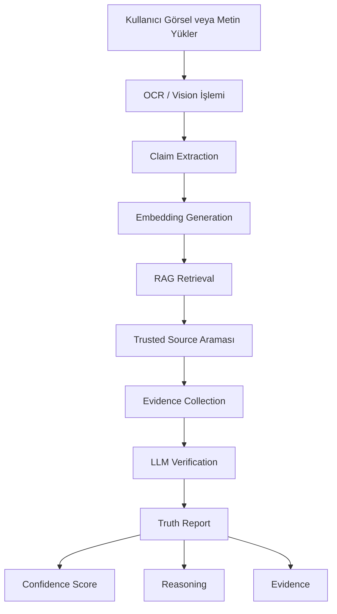
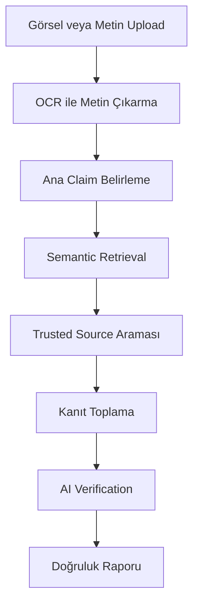
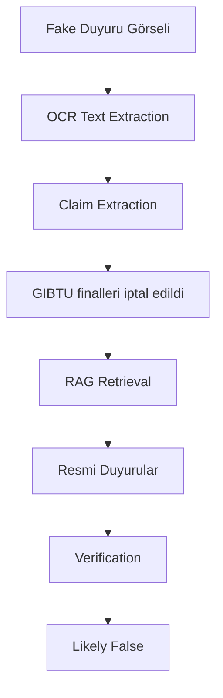
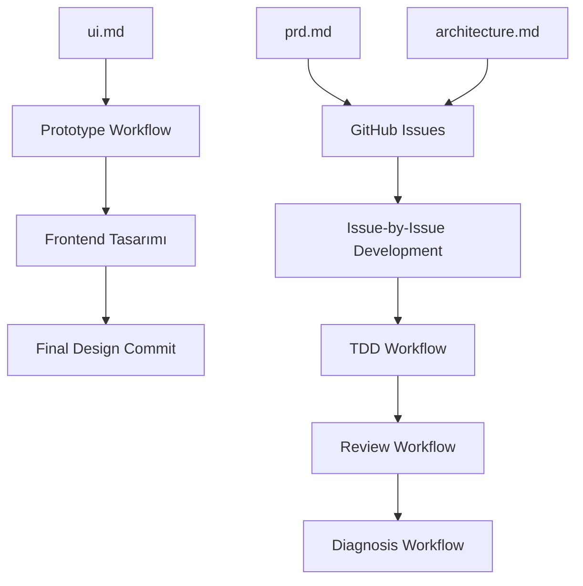

# ProofLens

ProofLens, şüpheli ekran görüntülerini veya metin tabanlı iddiaları analiz ederek güvenilir kaynaklarla karşılaştıran AI destekli bir doğrulama sistemidir.

---

# Sistem Mimarisi



---

# Kullanıcı Akışı



---

# Örnek Verification Flow



---

# Tech Stack

## Frontend
- Next.js
- React
- TypeScript

## Backend
- Python
- FastAPI

## AI / Retrieval
- LangChain
- LangGraph-style workflow
- RAG pipeline
- OCR / Vision processing
- Embedding retrieval

## Storage
- SQLite
- Markdown knowledge base

## Testing
- pytest
- TDD workflow

---

# Geliştirme Workflow'um



---

# Projenin Amacı

ProofLens'in amacı:
- sahte duyuruları,
- scam iş / staj ilanlarını,
- yanlış bilgileri,
- manipüle edilmiş ekran görüntülerini

daha hızlı doğrulayabilen bir sistem oluşturmaktır.

Sistem, modelin kendi hafızasına güvenmek yerine evidence-based verification yaklaşımı kullanır.

---

# Quick Start

## Backend

```powershell
python -m venv .venv
.\.venv\Scripts\Activate.ps1
pip install -r requirements.txt
uvicorn prooflens.api:app --reload
```

## Frontend

```powershell
cd frontend
npm install
npm run dev
```

## Testler

```powershell
pytest

cd frontend
npm test
```
