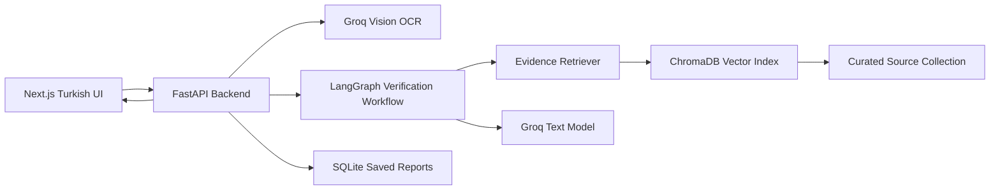

# ProofLens Architecture

ProofLens is a Turkish-first misinformation verification web app. The MVP turns screenshots or pasted claims into evidence-backed truth reports for two scenario families: suspicious university announcements and internship/job scam posts.

## Product Scope

The app is not a universal fact-checker. MVP verdicts are scoped to a curated trusted source corpus.

- University lane: supports the Gaziantep regional university set.
- GIBTU: complete demo path with deeper real official source coverage.
- Gaziantep University, Hasan Kalyoncu University, and SANKO University: lightweight support using university-wide official sources only.
- Internship/job scam lane: separate from the university lane and framed for Turkish students generally.
- Out-of-scope claims should usually produce `Dogrulanamadi` instead of overconfident answers.

## User Flow

1. User selects a scenario family:
   - `Universite duyurusu`
   - `Staj / is ilani`
2. If the university lane is selected, user chooses the university.
3. User uploads a screenshot or pastes suspicious text.
4. If the input is an image, the backend extracts text with Groq vision.
5. User reviews and edits the extracted text.
6. Backend runs the verification workflow.
7. UI shows a progress timeline:
   - `Metin okunuyor`
   - `Iddialar ayriliyor`
   - `Resmi kaynaklarda araniyor`
   - `Kanitlar karsilastiriliyor`
   - `Rapor hazirlaniyor`
8. UI renders a Turkish truth report with claim cards, citations, manipulation signals, and recommended actions.

## System Shape



## Frontend

Use Next.js, React, Tailwind CSS, and shadcn/ui if available.

The interface is Turkish-first and student-friendly. It should avoid formal bureaucratic language. Main verdict labels:

- `Dogru`
- `Yanlis`
- `Yaniltici`
- `Dogrulanamadi`

Confidence is shown as simple levels:

- `Yuksek guven`
- `Orta guven`
- `Dusuk guven`

Exact numeric confidence can exist in backend JSON, but should not be the main UI display.

Reports should always be generated in Turkish, even when the submitted screenshot or claim includes English wording.

The presentation path should include three prepared demo cases plus optional free input:

- fake GIBTU exam cancellation
- fake GIBTU internship/payment announcement
- internship scam post with registration fee

Each prepared demo case should have both a plain-text version for reliable testing and a screenshot version for the vision/OCR demo path.

The judge-facing dashboard should use the dark MacBook-style direction documented in `docs/ui/CONTEXT.md`. The report UI should include:

- a compact summary strip showing checked claims, official sources scanned, and risk signals found
- a screenshot preview when the user submits or selects a screenshot demo case
- source badges for trust level, institution, and retrieval date
- a visually stronger overall verdict header
- clear separation between evidence, manipulation signals, and recommended actions

## Backend

Use FastAPI because the core workflow is Python-native:

- LangGraph for controlled verification steps
- ChromaDB for vector retrieval
- local multilingual embeddings for Turkish source search
- SQLite for optional saved report history
- Groq for vision and text reasoning

The backend should return UI-first structured JSON. Raw agent messages should not be returned to the normal frontend.

## Verification Workflow

Implement the workflow as LangGraph-style controlled nodes rather than free-form agent chat.

Nodes may call typed tools when needed, but v1 tools must stay inside the seeded source corpus and backend services. They should not browse the live internet during verification.

Recommended nodes:

1. Input classifier
   - Determines text vs image.
   - Routes images to Groq vision.
2. Text extraction/review preparation
   - Produces editable extracted text for the frontend.
3. Claim extractor
   - Extracts conservative checkable claims.
   - Ignores tiny fragments, emotional wording, and non-verifiable opinions.
4. Evidence retriever
   - Searches the relevant source collection.
   - University lane uses selected university corpus.
   - Internship lane uses scam guidance and synthetic employer/demo sources.
   - Calls retrieval tools instead of relying on model memory.
5. Skeptic
   - Checks whether retrieved evidence really supports or contradicts each claim.
   - Pushes uncertain cases toward `Dogrulanamadi`.
   - May request one additional retrieval attempt with a rewritten query when initial evidence is weak.
6. Verdict generator
   - Assigns per-claim verdict and internal numeric confidence.
7. Report writer
   - Produces student-friendly Turkish explanations, overall verdict, and recommended actions.

Recommended v1 tools:

- `extract_text_from_image`: sends screenshots to Groq vision and returns editable text.
- `retrieve_evidence`: searches ChromaDB with scenario and university filters.
- `get_source_metadata`: returns title, owner, URL, retrieval date, trust level, and synthetic/official status.
- `detect_manipulation_signals`: detects risk patterns such as urgency, payment requests, anonymous authority, missing date, and no official source.
- `save_report`: optionally stores structured report JSON in SQLite.

## Verdict Rules

- `Dogru`: trusted evidence supports the claim.
- `Yanlis`: trusted evidence directly contradicts the claim.
- `Yaniltici`: trusted evidence shows partial truth, missing context, exaggeration, or unsupported implication.
- `Dogrulanamadi`: trusted evidence is missing, insufficient, or inconclusive.

Manipulation signals do not determine the verdict by themselves. They appear separately as risk indicators.

## Source Corpus

V1 uses a manually curated source collection. Automatic crawling, source refresh, and direct source insertion through the product UI are v2.

Recommended repo layout:

```text
trusted_sources/
  universities/
    gibtu/
      announcements.md
      academic-calendar.md
      regulations.md
      student-affairs.md
      fees.md
      career-internship.md
    gaziantep-university/
      announcements.md
      academic-calendar.md
      regulations.md
    hasan-kalyoncu-university/
      announcements.md
      academic-calendar.md
      regulations.md
    sanko-university/
      announcements.md
      academic-calendar.md
      regulations.md
  internship-scam/
    public-scam-guidance.md
    synthetic-employer-policy.md
```

Source files should be markdown with metadata:

```md
---
title: "2025-2026 Akademik Takvim"
institution: "GIBTU"
source_owner: "GIBTU Ogrenci Isleri"
source_type: "official_calendar"
trust_level: "official"
url: "https://..."
retrieved_at: "2026-05-12"
synthetic: false
---

Source text...
```

For real universities, sources must be official:

- university main website pages
- official announcements
- academic calendars
- regulations/directives
- student affairs pages
- career center pages
- official social media only when linked from the university website

Do not use student groups, unofficial social media pages, news summaries, screenshots with no link, AI summaries, or forums as official evidence.

## Retrieval

Use ChromaDB with a local multilingual embedding model:

`sentence-transformers/paraphrase-multilingual-MiniLM-L12-v2`

Retrieval should filter by scenario family and, for the university lane, by selected university. This prevents evidence from one university from affecting another university's verdict.

## Response Contract

The backend response should be optimized for claim-card rendering.

```json
{
  "input_type": "image",
  "scenario_family": "university_announcement",
  "selected_university": "GIBTU",
  "extracted_text": "...",
  "overall_verdict": "Supheli",
  "overall_confidence_level": "Orta guven",
  "claims": [
    {
      "claim": "Final sinavlarinin iptal edildigi iddia ediliyor.",
      "verdict": "Dogrulanamadi",
      "confidence_level": "Orta guven",
      "explanation": "Indekslenen resmi kaynaklarda bu iptali dogrulayan bir duyuru bulunamadi.",
      "supporting_evidence": [],
      "contradicting_evidence": [],
      "sources_checked": [
        {
          "title": "2025-2026 Akademik Takvim",
          "source_owner": "GIBTU Ogrenci Isleri",
          "trust_level": "official",
          "url": "https://...",
          "retrieved_at": "2026-05-12",
          "snippet": "..."
        }
      ],
      "manipulation_signals": [
        "resmi kaynak yok",
        "acil dil"
      ]
    }
  ],
  "recommended_actions": [
    "Bu bilgiye dayanarak hareket etmeden once resmi duyuru sayfasini kontrol et.",
    "Gerekirse ogrenci isleriyle iletisime gec."
  ]
}
```

## Storage And Privacy

- Uploaded screenshots are temporary uploads and should be deleted after text extraction and verification.
- No login is required in MVP.
- Reports may be saved locally in SQLite only when useful for demo history.
- Raw screenshots should not be saved by default.
- Account-based saved history is v2.

## Implementation Roadmap

Build backend credibility before UI polish:

1. Create curated source corpus files.
2. Seed source chunks into ChromaDB.
3. Build FastAPI verification endpoint for pasted text.
4. Prepare the three fixed demo cases.
5. Add screenshot OCR and extracted text review.
6. Build the Turkish Next.js interface.
7. Add optional saved report/history polish.

## V2 Candidates

- Login/accounts
- Source insertion through an admin UI
- Automatic university site crawling and source refresh
- PDF ingestion
- Multi-user saved report history
- Broader university support outside Gaziantep
- More scenario families
